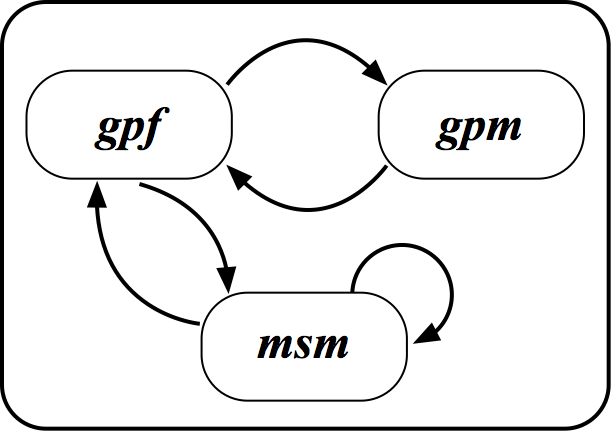

```{r setup, include = FALSE}
knitr::opts_chunk$set(
  collapse = TRUE,
  comment = "#>"
)
options(knitr.table.format = "html")
```

This vignette will demonstrate how to estimate HIV transmission rates using DNA sequences from Senegal. This also provides a guidance on how analysis described in Nascimento, (...), Volz, 2018 was carried out. 

## Basic requirements
This vignette assumes that you know the basics of R and have the following packages already installed:

* devtools: useful for installing packages directly from github         repository, for example. 
* phydynR: it implements the coalescent simulation and likelihood       function for phylodynamics analysis
* akima: this package is necessary for interpolation of data (used      for the calculation of the likelihood by the phydynR package)
* BayesianTools: package for Bayesian inference

### Load the necessary packages:
```{r message = FALSE}
  library(phydynR)
  library(akima)
  library(BayesianTools)
```

## The Model
The model we fit is based on the structured coalescent models [@Volz2012]. These models are used to estimate epidemiological parameters using a phylogenetic tree and information on states of each tip of the tree. Theses states are discrete-trait information representing each sequences.

In our mathematical model we have 4 different discrete-traits, that we further explain in along this vignette:

* $gpf$ = HIV sample from the general population -- females;
* $gpm$ = HIV sample from the general population -- males;
* $msm$ = HIV sample from men that have sex with other men;
* $src$ = source sample, which are HIV samples from individuals that are from other countries and not from Senegal 

### Stage of infection

We fit the HIV epidemic in Senegal using ordinary differential equations (ODE) and only 1 stage of infection. This means that infected individuals would die and not recover from the infection. In our model we represented it as $\gamma$ rate. We used 1 stage of infection, because the metadata available for the Senegal sequences did not have information that we could use to determine the stage of HIV infection at the time the samples were collected. 

### How transmissions were modelled?

* An infected $msm$ ($I_{msm}$) could transmite to another $msm$ with probability $p_{msm2msm}$
* An infected $msm$ ($I_{msm}$) could transmit to a $gpf$ with probability  $(1 - p_{msm2msm})$
* An infected $gpf$ ($I_{gpf}$) could transmit to a $gpm$ with probability $p_{gpf2gpm}$
* An infected $gpf$ ($I_{gpf}$) could transmit to a $msm$ with probability $(1 - p_{gpf2gpm})$
* An infected $gpm$ could also transmit to a $gpf$. For this event, we used the risk ratio of a male to transmite to a female, and fixed it to $2.0$. This is the parameter $maleX$ of our model.

```{r out.width = "50%", fig.align="center", fig.cap="Transmission model for HIV in Senegal", echo = FALSE}

```

### How about HIV incidence rate?

We also modelled the HIV incidence rate as a funtion of time ($t$) in $msm$ and the $gp$ (general population) as different spline functions [@Eilers1996], that in our ODEs will be represented by $\lambda(t)$ and $\mu(t)$, respectively.

### The $source$ compartment!

Finally, to model the HIV epidemic in Senegal, we also added an additional compartment named "source" ($src$), that is reprsent the rate lineages are imported to Senegal from other countries. We modelled this as a constant efective population size rate, with two parameters to be estimeted in our models -- srcNe: the effective source population size; and the $import$ rate. Because, as mentioned, these are modeled as constant effective population size, the infected $src$ individuals along time are not represented in the ODEs below. 


The ODEs, or model equations, are:

\begin{aligned}
\dot{I}_{msm} &= [p_{msm2msm}I_{msm} + (1 - p_{gpf2gpm})I_{msm}] \lambda(t) - \gamma I_{msm}  \\
\dot{I}_{gpf} &= [p_{gpf2gpm}I_{gpf} + (1 - p_{msm2msm})I_{gpf}] \mu(t) - \gamma I_{gpf}  \\
\dot{I}_{gpm} &= (male_xI_{gpm}) \mu(t) - \gamma I_{gpm}
\end{aligned}

### How to express the mathematical model in R?

In our model, we are interested in HIV transmission in the general population ($gp$) and in the $msm$ risk group. But also remember that we have to consider the imported HIV, which is in the $src$ compartment. Based on that, $gpf$, $gpm$, $msm$, and $src$ are the demes of our model, and are represented as a vector in R as:

```{r echo = FALSE}
demes <- c('gpm', 'gpf', 'msm', 'src')
```

Because we use spline functions to determine the shape of the curve for the transmission rates in $gp$ and $msm$, we should provide the initial `T0` and final `T1` times for our simulations.

```{r}
T0 <- 1978
T1 <- 2014
```

We can also go ahead and set the value for the stage of infection, that in our model is just one stage. We assume we know this value.

```{r}
GAMMA <- 1/10
```

We also should create a list for parameter values of our model. You can set this to values that you think are appropriate. Remember that the majority of parameter values in this list will be estimated. In R, this can be created following:

```{r}
THETA <- list(
  gpsp0 = 6/10,
  gpsp1 = 4/10,
  gpsp2 = 1/10,
  gpsploc = 1987,
  msmsp0 = 4/10,
  msmsp1 = 4/10,
  msmsp2 = 2/10,
  msmsploc = 1995,
  maleX = 1.25,
  import = 1/20,
  srcNe = 1/10,
  gpspline = function( t, parms ){
    if (t < T0 ) return( parms$gpsp0 )
    if (t > T1) return (parms$gpsp2)
    with(parms, aspline( x = c(T0, gpsploc, T1), y=c(gpsp0, gpsp1, gpsp2) , xout = t)$y)
  },
  msmspline  = function( t, parms){
    if (t < T0 ) return( parms$msmsp0 )
    if (t > T1) return ( parms$msmsp2 )
    with(parms, aspline( x = c(T0, msmsploc, T1), y=c(msmsp0, msmsp1, msmsp2) , xout = t)$y)
  },
  pmsm2msm = 0.85,
  pgpf2gpm = 0.85,
  initmsm = 1,
  initgp = 1
)
```

Note that parameters $gpsp0$, $gpsp1$, $gpsp2$, and $gpsploc$ are necessary to estimate the spline function for the $gp$ ($gpspline$ in R or $\mu(t)$ in the ODE). And parameters $msmsp0$, $msmsp1$, $msmsp2$, $msmsploc$ are necessary to estimate the spline function for the $msm$ risk group ($msmspline$ in R or $\lambda(t)$ in the ODE).

```{r echo = FALSE}
Parameter = c("Spline shape gp0",
              "Spline shape gp1",
              "Spline shape gp2",
              "Spline interval gp",
              "Spline shape msm0",
              "Spline shape msm1",
              "Spline shape msm2",
              "Spline interval msm",
              "Infectiouness ration from male to female",
              "Importation rate",
              "Effective population size of src",
              "Probability of msm infect another msm",
              "Probability of gpf to infect a gpm",
              "Initial number of msm",
              "Initial number of gp") 
`Symbol in R` = c("gpsp0",
           "gpsp1",
           "gpsp2",
           "gpsploc",
           "msmsp0",
           "msmsp1",
           "msmsp2",
           "msmsploc",
           "maleX",
           "import",
           "srcNe",
           "pmsm2msm",
           "pgpf2gpm",
           "initmsm",
           "initgp"
           ) 

`Initial values` = c("6/10",
                   "4/10",
                   "1/10",
                   "1987",
                   "4/10",
                   "4/10",
                   "2/10",
                   "1995",
                   "1.25",
                   "1.20",
                   "1.10",
                   "0.85",
                   "0.85",
                   "1.0",
                   "1.0") 
data_list = data.frame(Parameter, `Symbol in R`, `Initial values`) 
data_list <- as.matrix(data_list)
colnames(data_list)<-c("Parameter","Symbol in R",
                    "Initial values")

kable_table <- knitr::kable(data_list)
kableExtra::kable_styling(kable_input = kable_table, bootstrap_options = "striped", position = "center", font_size = 12)
```


We also need to setup some initial conditions of our model. We should set an arbitrary large number for the $src$ population, 
```{r}
SRCSIZE <<- 1e5
X0 <- c(gpm = unname(THETA$initgp/2), gpf = unname(THETA$initgp/2), msm = unname(THETA$initmsm) , src = SRCSIZE)
```


__Setting up the birth, migration and death rates__

The calculation of births and migrations of our model are expressed as 4 $\times$ 4 matrices, which represent a tranmission or movement from one deme to another deme. Lineages also die at a same rate.

First, we have to setup the components of the model. This can easily be done using the the `setup.model.equations` function in this research compendium. 

```{r message = FALSE}
eqns <- senegalHIVmodel::setup.model.equations(demes)
attach(eqns)
```


__Setting up the birth matrix__

Note that each element in the matrix is a string that will be passed as R code
```{r}
births['msm', 'msm'] <- "parms$msmspline(t, parms) * msm * parms$pmsm2msm"
births['msm', 'gpf'] <- "parms$msmspline(t, parms) * msm * (1-parms$pmsm2msm)"

births['gpm', 'gpf'] <- "parms$gpspline(t, parms) * gpm * parms$maleX"
births['gpf', 'gpm'] <- "parms$gpspline(t, parms) * gpf * parms$pgpf2gpm"
births['gpf', 'msm'] <- "parms$gpspline(t, parms) * gpf * (1-parms$pgpf2gpm)"

# f = (1/2)*(Y^2)/Ne
births['src', 'src'] <- "0.5*SRCSIZE^2/parms$srcNe"

kable_table <- knitr::kable(births)
kableExtra::kable_styling(kable_input = kable_table, bootstrap_options = "striped", full_width = F, position = "center", font_size = 12)
```

```{r}
sometext <- strsplit(paste0(
  "You can even try to make some crazy things like this paragraph. ", 
  "It may seem like a useless feature right now but it's so cool ",
  "and nobody can resist. ;)"
), " ")[[1]]
text_formatted <- paste(kableExtra::text_spec(sometext, "html", color = spec_color(1:length(sometext), end = 0.9), font_size = spec_font_size(1:length(sometext), begin = 5, end = 20)), collapse = " ")
```

__Setting up the migration matrix__

```{r}
migs['src', 'gpm'] <- "parms$import * gpm"
migs['src', 'gpf'] <- "parms$import * gpf"
migs['src', 'msm'] <- "parms$import * msm"

migs['gpm', 'src'] <- "parms$import * gpm"
migs['gpf', 'src'] <- "parms$import * gpf"
migs['msm', 'src'] <- "parms$import * msm"
```

__Setting up the vector for the death rates__

```{r}
deaths['msm'] <- 'GAMMA * msm'
deaths['gpf'] <- 'GAMMA * gpf'
deaths['gpm'] <- 'GAMMA * gpm'
deaths['src'] <- '.5*SRCSIZE^2/parms$srcNe'
```

__The demographic model__

After setting up all the componenets of the mathematical model, we can build the demographic process using the function `build.demographic.process`. The `dm` output can be used as imput to coalescent models for the calculation of the likelihood, when fitting the model using a Markov chain Monte Carlo (MCMC), for example.

```{r}

dm <- build.demographic.process(births = births, deaths = deaths, migrations = migs, parameterNames = names(THETA), rcpp = FALSE, sde = FALSE)
```


## References
