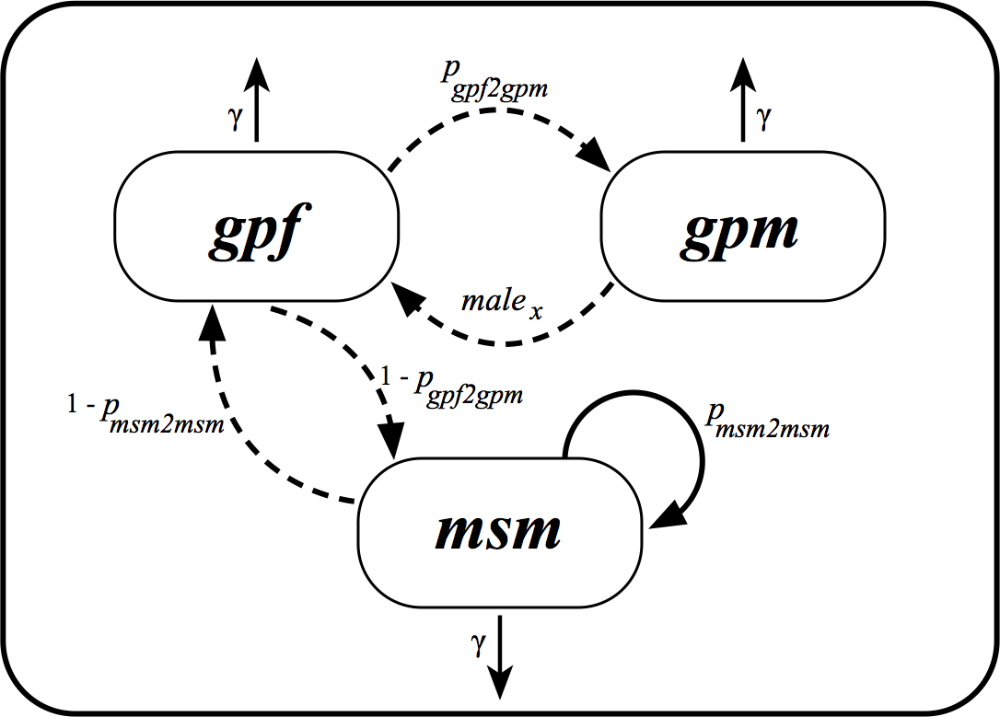

```{r setup, include = FALSE}
knitr::opts_chunk$set(
  collapse = TRUE,
  fig.pos = 'H',
  comment = "#>"
)
options(knitr.table.format = "latex")
```

# Introduction

* Phylogenetic trees were estimated using the RaxML for each HIV-1 subtype: B, C,
  and 02_AG;
* Using information on when sequences were collected, a phylogenetic tree,
in which branch length were in units of calendar times, were also estimated 
using treedater;
* These dated phylogenetic trees were analysed in separate for subtypes C and 
  02_AG, and for the combined subtypes (which we merged the trees for subtypes 
  B, C and 02_AG into a single tree);
* Each tip of the pylogenetic tree was associated to a state (see section below);
* If a tip could not be associated to a state (because of missing information 
  in the metadata), this particular tip was removed from the dated tree;
* The dated phylogenetic trees, in which all tips could be assigned to a state, 
  were then used with phydynR to estimate the transmission rates and parameters 
  of the model (see below for more information on which parameters we 
  estimated).


# The Model
The model we fit is based on the structured coalescent models [@Volz2012]. These 
models are used to estimate epidemiological parameters using a phylogenetic 
tree, that describes the transmission history of viruses between individuals,
and information on states of each tip of the tree. These states are 
discrete-trait information representing each sequence/individual.

In our mathematical model we have 4 different discrete-traits associated to each 
DNA sequence:

* $gpf$ = infected heterosexual females from the general population;
* $gpm$ = infected heterosexual males from the general population;
* $msm$ = infected male that have sex with other men;
* $src$ = source sample, which are infected individuals that are from other 
countries and not from Senegal. 

## Stage of infection

We fit the HIV epidemic in Senegal using ordinary differential equations (ODE) 
and only 1 stage of infection. This means that infected individuals would die 
and not recover from the infection. In our model we represented it as $\gamma$ 
rate. We used 1 stage of infection, because the metadata available for the 
Senegal sequences did not have information that we could use to determine the 
stage of HIV infection at the time the samples were collected. 

## How transmissions were modelled?

* An infected $msm$ ($I_{msm}$) could transmite to another $msm$ with 
probability $p_{msm2msm}$
* An infected $msm$ ($I_{msm}$) could transmit to a $gpf$ with probability 
$(1 - p_{msm2msm})$
* An infected $gpf$ ($I_{gpf}$) could transmit to a $gpm$ with probability 
$p_{gpf2gpm}$
* An infected $gpf$ ($I_{gpf}$) could transmit to a $msm$ with probability 
$(1 - p_{gpf2gpm})$
* An infected $gpm$ ($I_{gpm}$) could also transmit to a $gpf$. This is the 
risk ratio of a male ($gpm$) to transmite to a female ($gpf$), and is 
the parameter $male_{x}$ of our model.

See Figure 1 for a partil schematic representation of the transmission model 
for HIV in Senegal. In this figure $gpf$, $gpm$ and $msm$ represent the 
infected individuals.

```{r out.width = "90%", fig.align="center", fig.cap="Transmission model for HIV in Senegal. $gpf$, $gpm$ and $msm$ represent infected individuals.", echo = FALSE}

```

## How about HIV incidence rate?

We also modelled the HIV incidence rate as a funtion of time ($t$) in $msm$ and 
the $gp$ (general population) as different linear functions, that in our ODEs 
are represented by $\lambda(t)$ and $\mu(t)$, respectively.

## The $source$ compartment

Finally, to model the HIV epidemic in Senegal, we also added an additional 
compartment named "source" ($src$), that represents the rate in which HIV 
lineages are imported to Senegal from other countries. This was modelled as 
a constant efective population size rate with two parameters to be 
estimeted -- $srcNe$: the effective source population size; and the $import$ 
rate. Because the number of imported HIV balances the number of exported HIV, 
the infected $src$ individuals along time are not represented in the ODEs. 

## The ODEs or mathematical model equations


$\dot{I}_{gpf} = male_x \mu(t) I_{gpm} + (1 - p_{msm2msm}) \lambda(t) I_{msm} - \gamma I_{gpf}$

$\dot{I}_{gpm} = p_{gpf2gpm} \mu(t) I_{gpf} - \gamma I_{gpm}$

$\dot{I}_{msm} = (1 - p_{gpf2gpm}) \mu(t) I_{gpf} + p_{msm2msm} \lambda(t) I_{msm} - \gamma I_{msm}$


# Estimation of epidemiological parameters

For the Senegal HIV model, we are estimating the parameters using a 
Markov chain Monte Carlo (MCMC) as implemented in the R package [BayesianTools]("https://github.com/florianhartig/BayesianTools").

## Parameters to be estimated and priors

**Parameters for estimating the linear function for _gp_:**

* _gpsp0_: prior chosen with mean around $R_0 = 1.0$
* _gpsp1_: prior chosen with mean around $R_0 = 1.0$
* _gpsp2_: prior chosen with mean around $R_0 = 1.0$
* _gpsploc_

**Parameters for estimating the linear function for _msm_:**

* _msmsp0_: prior chosen with mean around $R_0 = 1.0$
* _msmsp1_: prior chosen with mean around $R_0 = 1.0$
* _msmsp2_: prior chosen with mean around $R_0 = 1.0$
* _msmsploc_

Note that the linear function parameters (_gpsp0_, _gpsp1_, _gpsp2_, _msmsp0_,
_msmsp1_, _msmsp2_) represent the number of transmissions per 
infected individual. Give the equation for R~0~, we have:
$R_0 = \beta/\gamma$

In our model $\gamma = 0.1$, and $\beta$ will be represented by each of 
the linear function parameters. We are aiming to have lines representing the 
trend on the number of tansmissions per infected individuals.

**Parameters that controls the _src_:**

* _import_: prior chosen with mean around $0.03$
* _srcNe_: prior chosen with mean around $100$

**Probability of certain events to occour:** 

* _pmsm2msm_ : prior chosen with mean around $0.80$
* _pgpf2gpm_ : prior chosen with mean around $0.80$

**Initial population sizes:**

* _initgp_: prior chosen with mean around $3$
* _initmsm_: prior chosen with mean around $3$

See Table 1 for a list of parameters that we are estimating and the priors used. 
Note that lower and upper bounds for the priors were used to keep the posterior 
distribution at sensible values when using MCMC. If such bounds were not 
provided negative or very high values, when low values were expected,
could be proposed during the MCMC. 

```{r echo = FALSE}
Parameter = c("Spline shape gp0",
              "Spline shape gp1",
              "Spline shape gp2",
              "Spline interval gp",
              "Spline shape msm0",
              "Spline shape msm1",
              "Spline shape msm2",
              "Spline interval msm",
              "Infectiouness ratio from male to female",
              "Importation rate",
              "Effective population size of src",
              "Probability of infected msm to infect another msm",
              "Probability of infected gpf to infect a gpm",
              "Initial number of infected msm",
              "Initial number of infected gp") 
`Symbol in R` = c("gpsp0",
                  "gpsp1",
                  "gpsp2",
                  "gpsploc",
                  "msmsp0",
                  "msmsp1",
                  "msmsp2",
                  "msmsploc",
                  "maleX",
                  "import",
                  "srcNe",
                  "pmsm2msm",
                  "pgpf2gpm",
                  "initmsm",
                  "initgp") 
Priors = c("Gamma(3, 3/0.1)",
           "Gamma(3, 3/0.1)",
           "Gamma(3, 3/0.1)",
           "U(1978, 2014)",
           "Gamma(3, 3/0.1)",
           "Gamma(3, 3/0.1)",
           "Gamma(3, 3/0.1)",
           "U(1978, 2014)",
           "U(0.5, 2)",
           "Exp(30)",
           "Exp(1/100)",
           "Beta(16, 4)",
           "Beta(16, 4)",
           "Exp(1/3)",
           "Exp(1/3)")
Lower = c("0.05",
          "0.05",
          "0.05",
          "1978",
          "0.05",
          "0.05",
          "0.05",
          "1978",
          "0.5",
          "0",
          "1",
          "0",
          "0",
          "1",
          "1")
Upper = c("1",
          "1",
          "1",
          "2014",
          "1",
          "1",
          "1",
          "2014",
          "10",
          "0.30",
          "5000",
          "1",
          "1",
          "300",
          "300")
data_list = data.frame(Parameter, `Symbol in R`, Priors, Lower, Upper) 
data_list <- as.matrix(data_list)
colnames(data_list)<-c("Parameter","Symbol in R",
                       "Prior", "Lower", "Upper")

kable_table <- knitr::kable(data_list, booktabs = T, caption =  "Parameter definition, symbols used in the ODEs, priors with lower and upper bounds")
kableExtra::kable_styling(kable_input = kable_table,
                          latex_options = c("striped", "scale_down", "hold_position"),
                          full_width = FALSE, position = "center")
```

# Variations of the models we tested

We tested several variations of the models using the phylogenetic tree for
all subtypes combined, and for subtypes C and 02_AG, in separate.
For some models we added information on surveillance data to the likelihood 
function. Reason to do that was based on preliminary results for the combined 
data in which was showing a lower PAF. We used information on surveillance data 
to check whether PAF would increase and would align more with the results in 
Christinah et al. 2018's paper.

**All subtypes combined**

Only sequences from Dakar were included in these analyses.

Models 2, 3 and 4 do **not** add information on surveillance data.

Models 5, 6 and 7 add information on surveillance data

* In Model 2 and Model 5, self-reported $gpm$ was coded 1, and self-reported $msm$ 
  was coded 1 in phylodynamic analyses

* In Model 3 and Model 6, all self-reported $gpm$ was removed from the 
  phylogenetic tree

* In Model 4 and Model 7, self-reported $gpm$ was coded as 0.5 $gpm$ and 
  0.5 $msm$ in phylodynamic analyses
  
**Analyses by subtypes**

All sequences from Senegal included in the analyses.

Models 1 and 2 do **not** add information on prevalence.

Models 3 and 4 add information on prevalence

* In Model 1 and Model 3 self-reported $gpm$ was coded 1, and self-reported 
  $msm$ was coded 1 in phylodynamic analyses

* In Model 2 and Model 4 self-reported $gpm$ was coded as 0.5 $gpm$ and 0.5 $msm$ 
  in phylodynamic analyses


# Partial results

* A total of 116 and 355 sequences were analysed for subtype C and 
02_AG, respectively (including sequences that were not from Senegal, to 
represent the source compartment). From those, 100 and 302 are sequences
from Senegal.

* A total of 463 sequences were analysed for the combined dataset, including 
sequences from subtypes B, C and 02_AG from Dakar and from other coutries 
representing the source compartment). From those, 387 sequences are from Dakar.

* After fitting the mathematical model to the phylogenetic tree, we calculated
the effective number of infections, and PAF (population attributable fraction of transmissions), as exemplified in the attached plots.


## Some thoughts about the results

Results observed by subtype are very different, and we think this is because
the way the samples were sampled were not random, and the distribution of 
subtypes C and 02_AG differs between the heterosexual general population and msm.
For example: 40% of msm in Senegal are infected with subtype C, and 4-10% in
the general populatio and FSW (female sex workers)[@Ndiaye2009;@Ndiaye2013].


# References
