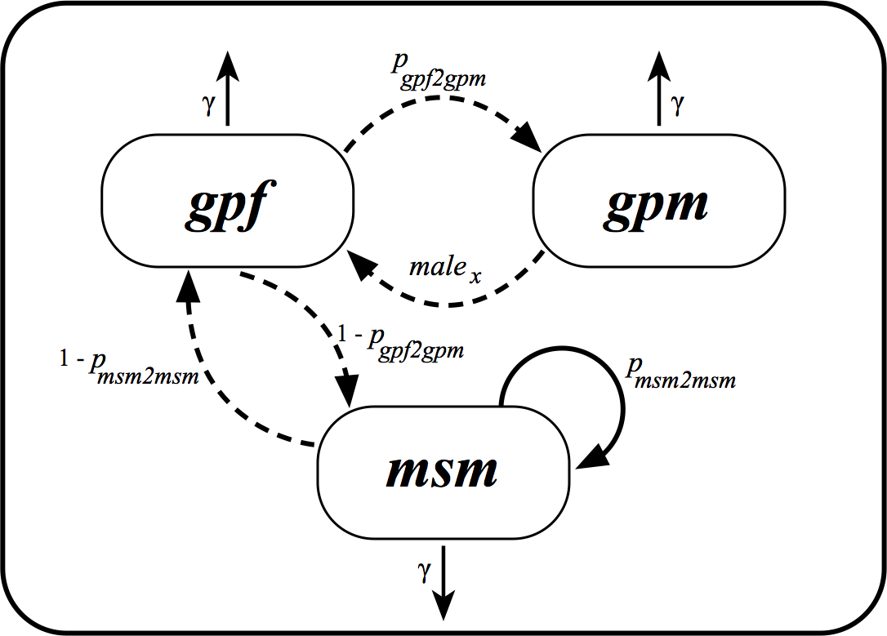

```{r setup, include = FALSE}
knitr::opts_chunk$set(
  collapse = TRUE,
  fig.pos = 'H',
  comment = "#>"
)
options(knitr.table.format = "latex")
```

# Introduction

* Phylogenetic trees were estimated using the RaxML for each HIV-1 subtype: C and 02_AG;
* Using information on when sequences were collected, a phylogenetic tree,
in which branch length were in units of calendar times, were also estimated using treedater;
* These dated phylogenetic trees were analysed in separate;
* Each tip of the pylogenetic tree was associated to a state (see section below);
* If a tip could not be associated to a state (because of missing information in the metadata),
this particular tip was removed from the dated tree;
* The dated phylogenetic tree for each subtype in which all tips could be assigned to a state 
were then used with phydynR to estimate the transmission rates and parameters of the model
(see below for more information on which parameters we are estimating).


# The Model
The model we fit is based on the structured coalescent models [@Volz2012]. These models are used to estimate epidemiological parameters using a phylogenetic tree and information on states of each tip of the tree. These states are discrete-trait information representing each sequence.

In our mathematical model we have 4 different discrete-traits associated to each DNA sequence:

* $gpf$ = infected heterosexual females from the general population;
* $gpm$ = infected heterosexual males from the general population;
* $msm$ = infected male that have sex with other men;
* $src$ = source sample, which are infected individuals that are from other countries and not from Senegal. 

## Stage of infection

We fit the HIV epidemic in Senegal using ordinary differential equations (ODE) and only 1 stage of infection. This means that infected individuals would die and not recover from the infection. In our model we represented it as $\gamma$ rate. We used 1 stage of infection, because the metadata available for the Senegal sequences did not have information that we could use to determine the stage of HIV infection at the time the samples were collected. 

## How transmissions were modelled?

* An infected $msm$ ($I_{msm}$) could transmite to another $msm$ with probability $p_{msm2msm}$
* An infected $msm$ ($I_{msm}$) could transmit to a $gpf$ with probability  $(1 - p_{msm2msm})$
* An infected $gpf$ ($I_{gpf}$) could transmit to a $gpm$ with probability $p_{gpf2gpm}$
* An infected $gpf$ ($I_{gpf}$) could transmit to a $msm$ with probability $(1 - p_{gpf2gpm})$
* An infected $gpm$ ($I_{gpm}$) could also transmit to a $gpf$. This is the risk ratio of a male ($gpm$) to transmite to a female ($gpf$). This is the parameter $male_{x}$ of our model.

See Figure 1 for a partil schematic representation of the transmission model for HIV in Senegal. In this figure $gpf$, $gpm$ and $msm$ represent the infected individuals.

```{r out.width = "90%", fig.align="center", fig.cap="Transmission model for HIV in Senegal. $gpf$, $gpm$ and $msm$ represent infected individuals.", echo = FALSE}

```

## How about HIV incidence rate?

We also modelled the HIV incidence rate as a funtion of time ($t$) in $msm$ and the $gp$ (general population) as different spline functions [@Eilers1996], that in our ODEs are represented by $\lambda(t)$ and $\mu(t)$, respectively.

## The $source$ compartment

Finally, to model the HIV epidemic in Senegal, we also added an additional compartment named "source" ($src$), that represents the rate in which HIV lineages are imported to Senegal from other countries. We modelled this as a constant efective population size rate with two parameters to be estimeted -- $srcNe$: the effective source population size; and the $import$ rate. Because the number of imported HIV balances the number of exported HIV, the infected $src$ individuals along time are not represented in the ODEs. 

## The ODEs or mathematical model equations


$\dot{I}_{gpf} = male_x \mu(t) I_{gpm} + (1 - p_{msm2msm}) \lambda(t) I_{msm} - \gamma I_{gpf}$

$\dot{I}_{gpm} = p_{gpf2gpm} \mu(t) I_{gpf} - \gamma I_{gpm}$

$\dot{I}_{msm} = (1 - p_{gpf2gpm}) \mu(t) I_{gpf} + p_{msm2msm} \lambda(t) I_{msm} - \gamma I_{msm}$


# Estimation of epidemiological parameters

For the Senegal HIV model, we are estimating the parameters using a Markov chain Monte Carlo (MCMC) as implemented in the R package [BayesianTools]("https://github.com/florianhartig/BayesianTools").

## Parameters to be estimated and priors

**Parameters for estimating the spline function for the _gp_:**

* _gpsp0_: prior chosen with mean around $R_0 = 1.1$
* _gpsp1_: prior chosen with mean around $R_0 = 1.1$
* _gpsp2_: prior chosen with mean around $R_0 = 1.1$
* _gpsploc_

**Parameters for estimating the spline function for the _msm_:**

* _msmsp0_: prior chosen with mean around $R_0 = 1.1$
* _msmsp1_: prior chosen with mean around $R_0 = 1.1$
* _msmsp2_: prior chosen with mean around $R_0 = 1.1$
* _msmsploc_

Note that the spline shape parameters (_gpsp0_, _gpsp1_, _gpsp2_, _msmsp0_, _msmsp1_, _msmsp2_)
represent the number of transmissions per infected individual. 
Give the equation for R_0, we have:
$R_0 = \beta/\gamma$

In our model $\gamma = 0.1$, and $\beta$ will be represented by each of the spline shape parameters.
We are aiming to have a curve representing the number of tansmissions per infected individuals

**Parameters that controls the _src_:**

* _import_: prior chosen with mean around $0.03$
* _srcNe_: prior chosen with mean around $100$

**Probability of certain events to occour:** 

* _pmsm2msm_ : prior chosen with mean around $0.80$
* _pgpf2gpm_ : prior chosen with mean around $0.80$

**Initial population sizes:**

* _initgp_: prior chosen with mean around $3$
* _initmsm_: prior chosen with mean around $3$

See Table 1 for a list of parameters that we are estimating and the priors used. 
Note that lower and upper bounds for the priors were used to keep the posterior 
distribution at sensible values when using the BayesianTools R package. If such 
bounds were not provided negative or very high values, when low values were expected,
could be proposed during the MCMC. 

```{r echo = FALSE}
Parameter = c("Spline shape gp0",
              "Spline shape gp1",
              "Spline shape gp2",
              "Spline interval gp",
              "Spline shape msm0",
              "Spline shape msm1",
              "Spline shape msm2",
              "Spline interval msm",
              "Infectiouness ratio from male to female",
              "Importation rate",
              "Effective population size of src",
              "Probability of infected msm to infect another msm",
              "Probability of infected gpf to infect a gpm",
              "Initial number of infected msm",
              "Initial number of infected gp") 
`Symbol in R` = c("gpsp0",
                  "gpsp1",
                  "gpsp2",
                  "gpsploc",
                  "msmsp0",
                  "msmsp1",
                  "msmsp2",
                  "msmsploc",
                  "maleX",
                  "import",
                  "srcNe",
                  "pmsm2msm",
                  "pgpf2gpm",
                  "initmsm",
                  "initgp") 
Priors = c("Gamma(3, 3/0.1)",
             "Gamma(3, 3/0.1)",
             "Gamma(3, 3/0.1)",
             "U(1978, 2014)",
             "Gamma(3, 3/0.1)",
             "Gamma(3, 3/0.1)",
             "Gamma(3, 3/0.1)",
             "U(1978, 2014)",
             "U(0.5, 2)",
             "Exp(30)",
             "Exp(1/100)",
             "Beta(16, 4)",
             "Beta(16, 4)",
             "Exp(1/3)",
             "Exp(1/3)")
Lower = c("0.05",
             "0.05",
             "0.05",
             "1978",
             "0.05",
             "0.05",
             "0.05",
             "1978",
             "0.5",
             "0",
             "1",
             "0",
             "0",
             "1",
             "1")
Upper = c("1",
             "1",
             "1",
             "2014",
             "1",
             "1",
             "1",
             "2014",
             "10",
             "0.30",
             "5000",
             "1",
             "1",
             "300",
             "300")
data_list = data.frame(Parameter, `Symbol in R`, Priors, Lower, Upper) 
data_list <- as.matrix(data_list)
colnames(data_list)<-c("Parameter","Symbol in R",
                       "Prior", "Lower", "Upper")

kable_table <- knitr::kable(data_list, booktabs = T, caption =  "Parameter definition, symbols used in the ODEs, priors with lower and upper bounds")
kableExtra::kable_styling(kable_input = kable_table,
                          latex_options = c("striped", "scale_down", "hold_position"),
                          full_width = FALSE, position = "center")
```

# Partial results

* We used a total of 116 and 355 sequences were analysed for subtype C and 
02_AG, respectively (including sequences that were not from Senegal, to 
represent the source compartment). From those, 100 and 302 are sequences
from Senegal.

* After fitting the mathematical model to the phylogenetic tree, we can calculate
the effective number of infections, the number of new cases, and 
PAF (proportion attributable fraction of transmissions), as exemplified in the 
plots below.


```{r echo = FALSE, message = FALSE, ,  warning = FALSE, fig.cap="Plot showing the effective number of infections for gpf, gpm, and msm"}
####### create plots
library(ggplot2)
library(phydynR)
library(reshape2)
library(senegalHIVmodel)


# Load solved objects
load("C.rda")

# gets the element sizes
sizes_C_1000 <- C_m1_o.1000[4,]

#re-organize demes by sizes element
o.sizes_C_1000 <- reorganize_deme_sizes(Nrep = 1000, Ntime = 1000,
                                        sizes = sizes_C_1000)

times_Cm1 <- C_m1_o.1000[[1]]

# get the dataframe to plot tajectories for sizes (median and quantiles)
m1_C_1000.mq <- median_and_quantiles(o.sizes_C_1000, times_Cm1)
m1_C_1000.mq["group2"] <- ifelse(m1_C_1000.mq$group == "msm", "msm", "gp")


# calculate sizes for MAP
mCm1_sizes_map <- reorganize_deme_sizes(Nrep = 1, Ntime = 1000,
                                            mC_m1_map_o[4])

#convert it to dataframe and transform to long format
mCm1.map.df <- data.frame(gpm=mCm1_sizes_map[[1]][1:1000],
                          gpf=mCm1_sizes_map[[2]][1:1000],
                          msm=mCm1_sizes_map[[3]][1:1000])
mCm1.map.df.m <- melt(mCm1.map.df)

#add map to dataframe
m1_C_1000.mq["MAP"] <- mCm1.map.df.m$value

#Plotting
cbPalette <- c("#E69F00", "#56B4E9", "#009E73", "#F0E442", "#0072B2", "#D55E00", "#CC79A7")

p1 <- ggplot(m1_C_1000.mq, aes(x=times)) +
  geom_ribbon(aes(ymin = lower, ymax = upper, fill = group), alpha=0.3) +
  geom_line(aes(y = median, colour=group), linetype="solid") +
  geom_line(aes(y = MAP, colour=group), linetype="longdash") +
  facet_wrap(~ group2, scales = "free") +
  ggtitle("Subtype C: effective number of infections") +
  ylab("Effective number of infections") +
  xlab("Time") + theme_bw() +
  scale_fill_manual(values=cbPalette) +
  scale_colour_manual(values=cbPalette)

p1
```

```{r echo = FALSE, message = FALSE,  warning = FALSE, fig.cap="Plot showing the number of new infections for gpf, gpm, and msm"}
####### create plots
library(ggplot2)
library(phydynR)
library(reshape2)
library(senegalHIVmodel)

# gets the element births. Births are the number of new HIV cases
bm1_C_1000 <- C_m1_o.1000[2,]
times_m1_C <- C_m1_o.1000[[1]]

# calculate the median and quantiles for new cases
all_m1_C <- births_newCases(bm1_C_1000, times_m1_C)
# calculate new cases for MAP
m1_C_nc_map <- t(sapply(mC_m1_map_o[[2]], calculate_newCases))

#convert it to dataframe and transform to long format
m1_C.map.df <- as.data.frame(m1_C_nc_map)
m1_C.map.df.m <- melt(m1_C.map.df)

#add map to dataframe
all_m1_C["MAP"] <- m1_C.map.df.m$value

cbPalette <- c("#E69F00", "#56B4E9", "#009E73", "#F0E442", "#0072B2", "#D55E00", "#CC79A7")
p2 <- ggplot(all_m1_C, aes(x=times)) +
  geom_ribbon(aes(ymin = lower, ymax = upper, fill = group), alpha=0.3) +
  geom_line(aes(y = median, colour=group), linetype="solid") +
  geom_line(aes(y = MAP, colour=group), linetype="longdash") +
  facet_wrap(~ group2, scales = "free") +
  ggtitle("Subtype C: number of new cases") +
  ylab("New cases") +
  xlab("Time") + theme_bw() +
  scale_fill_manual(values=cbPalette) +
  scale_colour_manual(values=cbPalette)

p2

```

```{r echo = FALSE, message = FALSE, warning = FALSE, fig.cap="Plot showing the proportion attributable fraction of transmissions"}
####### create plots
library(ggplot2)
library(phydynR)
library(reshape2)
library(senegalHIVmodel)

# gets the element births. Births are the number of new HIV cases
bm1_C_1000 <- C_m1_o.1000[2,]
times_m1_C <- C_m1_o.1000[[1]]

# calculate the median and quantiles for pafs
all_m1_C <- births_pafs(bm1_C_1000, times_m1_C)
# calculate pafs for MAP
m1_C_pafs_map <- t(sapply(mC_m1_map_o[[2]], calculate_pafs))

#convert it to dataframe and transform to long format
m1_C.map.df <- as.data.frame(m1_C_pafs_map)
m1_C.map.df.m <- melt(m1_C.map.df)

#add map to dataframe
all_m1_C["MAP"] <- m1_C.map.df.m$value

cbPalette <- c("#E69F00", "#56B4E9", "#009E73", "#F0E442", "#0072B2", "#D55E00", "#CC79A7")
p3 <- ggplot(all_m1_C, aes(x=times)) +
  geom_ribbon(aes(ymin = lower, ymax = upper, fill = group), alpha=0.3) +
  geom_line(aes(y = median, colour=group), linetype="solid") +
  geom_line(aes(y = MAP, colour=group), linetype="longdash") +
  facet_wrap(~ group2, scales = "free") +
  ggtitle("Subtype C: PAF") + ylab("PAF") +
  xlab("Time") + theme_bw() +
  scale_fill_manual(values=cbPalette) +
  scale_colour_manual(values=cbPalette)

p3

```


```{r echo = FALSE, message = FALSE, ,  warning = FALSE, fig.cap="Plot showing the effective number of infections for gpf, gpm, and msm"}
####### create plots
library(ggplot2)
library(phydynR)
library(reshape2)
library(senegalHIVmodel)


# Load solved objects
load("m02_AG.rda")

# gets the element sizes
sizes_m02_AGm1_1000 <- m02_AG_m1_o.1000[4,]

#re-organize demes by sizes element
o.sizes_m02_AGm1_1000 <- reorganize_deme_sizes(Nrep = 1000, Ntime = 1000,
                                              sizes = sizes_m02_AGm1_1000)
times.m02_AGm1 <- m02_AG_m1_o.1000[[1]]

# get the dataframe to plot tajectories for sizes (median and quantiles)
m02_AGm1_1000.mq <- median_and_quantiles(o.sizes_m02_AGm1_1000, times.m02_AGm1)
m02_AGm1_1000.mq["group2"] <- ifelse(m02_AGm1_1000.mq$group == "msm", "msm", "gp")


# calculate sizes for MAP
m02_AGm1_sizes_map <- reorganize_deme_sizes(Nrep = 1, Ntime = 1000,
                                      m02_AG_m1_map_o[4])

#convert it to dataframe and transform to long format
m02_AGm1.map.df <- data.frame(gpm=m02_AGm1_sizes_map[[1]][1:1000],
                              gpf=m02_AGm1_sizes_map[[2]][1:1000],
                              msm=m02_AGm1_sizes_map[[3]][1:1000])
m02_AGm1.map.df.m <- melt(m02_AGm1.map.df)

#add map to dataframe
m02_AGm1_1000.mq["MAP"] <- m02_AGm1.map.df.m$value

#Plotting
cbPalette <- c("#E69F00", "#56B4E9", "#009E73", "#F0E442", "#0072B2", "#D55E00", "#CC79A7")

p4 <- ggplot(m02_AGm1_1000.mq, aes(x=times)) +
  geom_ribbon(aes(ymin = lower, ymax = upper, fill = group), alpha=0.3) +
  geom_line(aes(y = median, colour=group), linetype="solid") +
  geom_line(aes(y = MAP, colour=group), linetype="longdash") +
  facet_wrap(~ group2, scales = "free") +
  ggtitle("Subtype 02_AG: effective number of infections") +
  ylab("Effective number of infections") +
  xlab("Time") + theme_bw() +
  scale_fill_manual(values=cbPalette) +
  scale_colour_manual(values=cbPalette)

p4
```

```{r echo = FALSE, message = FALSE,  warning = FALSE, fig.cap="Plot showing the number of new infections for gpf, gpm, and msm"}
####### create plots
library(ggplot2)
library(phydynR)
library(reshape2)
library(senegalHIVmodel)

# gets the element births. Births are the number of new HIV cases
bm1_02AG_1000 <- m02_AG_m1_o.1000[2,]
times_m1_02AG <- m02_AG_m1_o.1000[[1]]

# calculate the median and quantiles for new cases
all_m1_02AG <- births_newCases(bm1_02AG_1000, times_m1_02AG)
# calculate new cases for MAP
m1_02AG_nc_map <- t(sapply(m02_AG_m1_map_o[[2]], calculate_newCases))

#convert it to dataframe and transform to long format
m1_02AG.map.df <- as.data.frame(m1_02AG_nc_map)
m1_02AG.map.df.m <- melt(m1_02AG.map.df)

#add map to dataframe
all_m1_02AG["MAP"] <- m1_02AG.map.df.m$value


cbPalette <- c("#E69F00", "#56B4E9", "#009E73", "#F0E442", "#0072B2", "#D55E00", "#CC79A7")

p5 <- ggplot(all_m1_02AG, aes(x=times)) +
  geom_ribbon(aes(ymin = lower, ymax = upper, fill = group), alpha=0.3) +
  geom_line(aes(y = median, colour=group), linetype="solid") +
  geom_line(aes(y = MAP, colour=group), linetype="longdash") +
  facet_wrap(~ group2, scales = "free") +
  ggtitle("Subtype 02_AG: new cases") +
  ylab("New cases") +
  xlab("Time") + theme_bw() +
  scale_fill_manual(values=cbPalette) +
  scale_colour_manual(values=cbPalette)

p5
```

```{r echo = FALSE, message = FALSE, warning = FALSE, fig.cap="Plot showing the proportion attributable fraction of transmissions"}
####### create plots
library(ggplot2)
library(phydynR)
library(reshape2)
library(senegalHIVmodel)

# gets the element births. Births are the number of new HIV cases
bm1_02AG_1000 <- m02_AG_m1_o.1000[2,]
times_m1_02AG <- m02_AG_m1_o.1000[[1]]

# calculate the median and quantiles for pafs
all_m1_02AG <- births_pafs(bm1_02AG_1000, times_m1_02AG)
# calculate pafs for MAP
m1_02AG_pafs_map <- t(sapply(m02_AG_m1_map_o[[2]], calculate_pafs))

#convert it to dataframe and transform to long format
m1_02AG.map.df <- as.data.frame(m1_02AG_pafs_map)
m1_02AG.map.df.m <- melt(m1_02AG.map.df)

#add map to dataframe
all_m1_02AG["MAP"] <- m1_02AG.map.df.m$value


cbPalette <- c("#E69F00", "#56B4E9", "#009E73", "#F0E442", "#0072B2", "#D55E00", "#CC79A7")
p6 <- ggplot(all_m1_02AG, aes(x=times)) +
  geom_ribbon(aes(ymin = lower, ymax = upper, fill = group), alpha=0.3) +
  geom_line(aes(y = median, colour=group), linetype="solid") +
  geom_line(aes(y = MAP, colour=group), linetype="longdash") +
  facet_wrap(~ group2, scales = "free") +
  ggtitle("Subtype 02_AG: PAF") +
  ylab("PAF") +
  xlab("Time") + theme_bw() +
  scale_fill_manual(values=cbPalette) +
  scale_colour_manual(values=cbPalette)

p6

```


## Parameter of interest


```{r echo = FALSE}

Subtype = c("C", "02_AG") 
Median = c("0.848", "0.842") 
MAP = c("0.899", "0.869")
`2.5%` = c("0.706", "0.721")
`97.5%` = c("0.949", "0.923")

data_list = data.frame(Subtype, Median, MAP, `2.5%`, `97.5%`) 
data_list <- as.matrix(data_list)
colnames(data_list)<-c("Parameter","Median",
                       "MAP", "2.5%", "97.5%")

kable_table <- knitr::kable(data_list, booktabs = T, caption =  "Estimated values for parameter _pmsm2msm_ for subtypes C and 02_AG. Median, MAP (maximum a posterior), and credible intervals")
kableExtra::kable_styling(kable_input = kable_table,
                          latex_options = "striped",
                          full_width = TRUE, position = "center")

```

## Some thoughts about the results

Results observed by subtype are very different, and we think this is because
the way the samples were sampled were not random, and the distribution of 
subtypes C and 02_AG differs between the heterosexual general population and msm.
For example: 40% of msm in Senegal are infected with subtype C, and ca. 4-10% in
the general populatio and FSW (female sex workers)[@Ndiaye2009;@Ndiaye2013].


# References
